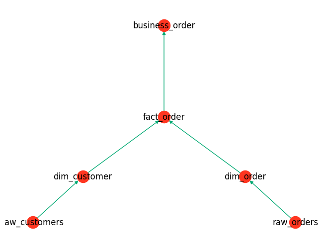

# SQL Executor

SQL Executor is a Python-based project designed to automate the parsing, execution of SQL scripts on a Databricks SQL Warehouse environment. The project streamlines the process of handling SQL script dependencies, executing parameterized SQL scripts (optional), and organizing executed scripts.

## Features

1. **SQL Script Parsing**: Utilizes [SQLGlot](https://sqlglot.com/sqlglot.html) to parse all SQL scripts from a specified directory, identifying dependencies and ensuring scripts are ready for execution.

2. **Dependency Graph Generation**: Leverages [NetworkX](https://networkx.org/) to generate a dependency graph from the parsed SQL scripts. The graph outlines the execution order and saves the dependencies as a YAML file for easy tracking and management.



3. **Parameter Replacement[optional]**: If the SQL scripts are parameterized, the project includes functionality to replace the parameters with actual values before execution, ensuring the scripts are tailored to the current context.

4. **SQL Execution in Databricks**: Executes the SQL scripts in a Databricks SQL Warehouse, harnessing the power and scalability of Databricks for data processing and analysis.

5. **Script Management**: Stores all executed SQL scripts into a separate directory, providing a clear record of the scripts that have been run and facilitating version control and auditing.

6. **Databricks SQL Connector**: Uses the [Databricks SQL Connector for Python](https://docs.databricks.com/en/dev-tools/python-sql-connector.html) to establish a connection to the Databricks SQL Warehouse, ensuring a seamless and secure integration.

## Getting Started

To get started with SQL Executor, follow these steps:

1. Ensure you have Python >=3.8 and <=3.11 installed on your development machine. It is recommended to use Python virtual environments for a clean and controlled project setup.

2. Install the necessary dependencies from `requirements.txt` using `pip`:

3. Set up your Databricks environment by gathering the server hostname, HTTP path, and access token for your Databricks cluster or SQL warehouse.

4. Configure the project settings, including the directories for source SQL scripts, dependencies, and executed scripts.

5. Run the `scheduler.py` to start the process of parsing, executing, and managing your SQL scripts.

## Project
```
├── README.md
├── config                                  #optional config 
├── lib                                     #base code            
│   ├── connect.py
│   ├── connection.py
│   ├── sql_parser.py
│   ├── task_executor.py
│   └── task_generator.py
├── no_used                                 #test files not used
│   ├── demo_task_executor.py
│   ├── run.py
│   └── test.py
├── requirements.txt
├── runs                                    #target directory
│   ├── DAGs                                #dags generated
│   │   ├── 1710605017_dag_run.png
│   ├── dependencies                        #dependecy yaml files
│   │   ├── 1710605017_dependencies.yaml
│   └── executed_sql                        #executed sql files
│       ├── 1710605017                      #unix epoch
│       │   ├── business_order.sql
│       │   ├── dim_customer.sql
│       │   ├── dim_order.sql
│       │   ├── fact_order.sql
│       │   ├── raw_customers.sql
│       │   └── raw_orders.sql
├── scheduler.py                            #main scheduler
└── source_sql                              #source directory for sql files
    ├── business
    │   └── business_order.sql
    ├── dimension
    │   ├── dim_customer.sql
    │   └── dim_order.sql
    ├── fact
    │   └── fact_order.sql
    ├── raw
        ├── raw_customers.sql
        └── raw_orders.sql
```

## Assumptions
1. Databricks Catalog and Schema already exists.
2. If the SQL are parameterised, add the replacement logic in the `sql_parser.py`. As of none of the sql scripts are paramerterized
3. The generated DAG, dependency yaml and the executed sql scripts are prefixed with UNIX Epoch for auditing. Regular cleanup is needed.

## Limitations
1. All the leaf source tables are executed as `select 1`. This is to avoid breaking the dependencies.
2. Multiple sql statements in one file is not supported.
3. Table name should be same as sql file name. Aliasing is not supported.
